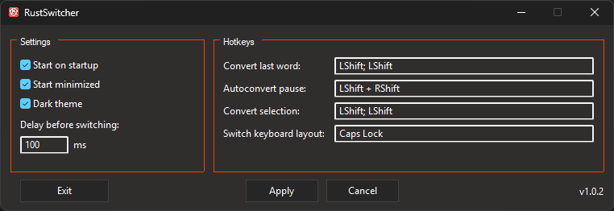

# Rust Switcher



Rust Switcher is a Windows 11 utility that helps convert text between RU and EN keyboard layouts.

## Features

- Convert selected text (RU-EN)
- Convert the last typed word via a hotkey
- Auto-convert the last word while typing (can be paused)
- Tray icon and quick actions menu
- Light and dark UI themes
- Settings are saved to a config file
- Autostart

## Requirements

- Windows 11
- Rust nightly (see `rust-toolchain.toml`)
- MSVC toolchain (Visual Studio 2022 Build Tools)

## Install

### Via cargo

```powershell
cargo install rust-switcher
````

### From GitHub Releases

Download `rust-switcher.exe` from Releases.

## Configuration

The config file is stored at:

* `%APPDATA%\RustSwitcher\config.json`

## Development

This project includes a ready-to-use `bacon.toml` for a fast development loop.

### Bacon hotkeys (from `bacon.toml`)

* `d` dev-long
* `r` release-long
* `t` test-long
* `p` dushnota

What these jobs do:

* dev-long: fmt check, clippy, build (with debug tracing), run the app
* release-long: fmt check, clippy, release build, run the app
* test-long: fmt check, clippy, run tests
* dushnota: максимально strict clippy

## Logging (development only)

```powershell
$env:RUST_LOG="trace"
cargo +nightly run -F debug-tracing
```

## License

MIT
