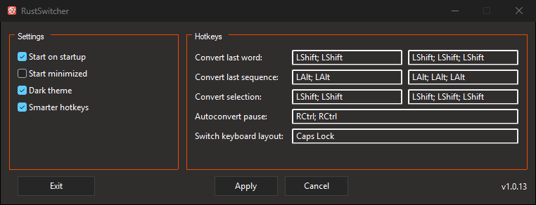

# Rust Switcher



Rust Switcher is a Windows 11 utility that helps convert text between RU and EN keyboard layouts.

## Features

- Convert selected text (RU↔EN)
- Convert the last typed sequence via a hotkey ("smart" conversion also handles selection)
- Auto-convert the last word while typing (runtime toggle, starts paused)
- Tray icon and quick actions menu
- Light and dark UI themes
- Settings are saved to a config file
- Autostart

## Requirements

- Windows 11
- Rust nightly (see `rust-toolchain.toml`)
- MSVC toolchain (Visual Studio 2022 Build Tools)

## Install

### Via cargo

```powershell
cargo install rust-switcher
```

### From GitHub Releases

Download `rust-switcher.exe` from Releases.

## Configuration

The config file is stored at:

* `%APPDATA%\RustSwitcher\config.json`

Default hotkey sequences:

* Convert last word: double tap Left Shift
* Convert last sequence: double tap Left Alt
* Convert selection: double tap Left Shift
* Autoconvert toggle: double tap Right Ctrl
* Switch layout: CapsLock

## Development

This project includes a ready-to-use `bacon.toml` for a fast development loop.

### Bacon hotkeys (from `bacon.toml`)

* `d` dev-long
* `r` release-long
* `t` test-long
* `p` dushnota

What these jobs do:

* dev-long: fmt check, clippy, build (with debug tracing), run the app
* release-long: fmt check, clippy, release build, run the app
* test-long: fmt check, clippy, run tests
* dushnota: strict clippy

## Logging (development only)

```powershell
$env:RUST_LOG="trace"
cargo +nightly run -F debug-tracing
```

## Hotkey timing probe (development only)

Use the diagnostic binary to measure real double/triple Shift tap timing before
tuning sequence windows:

```powershell
cargo +nightly run --features diagnostic-tools --bin rust-switcher-timing
```

The probe writes `target\timing-probe\latest.txt` and
`target\timing-probe\latest.json`.

## License

MIT
